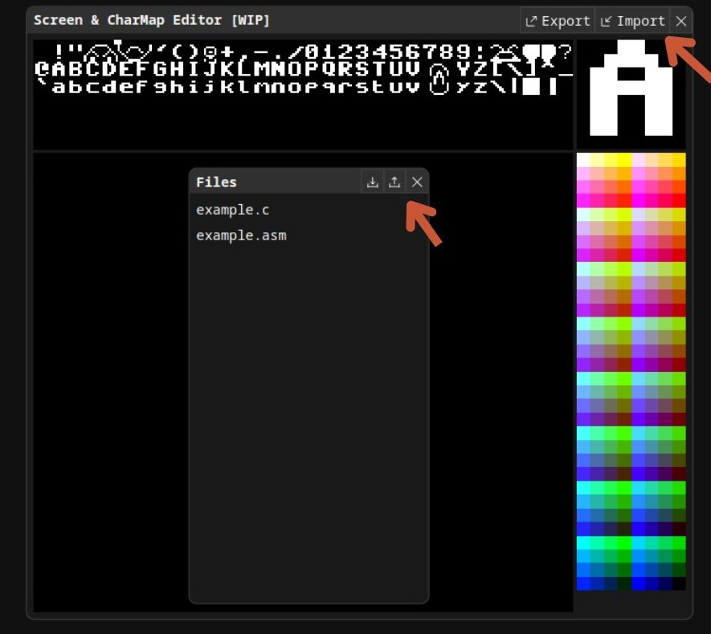
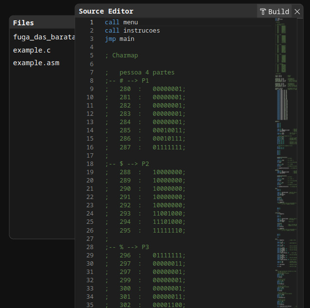
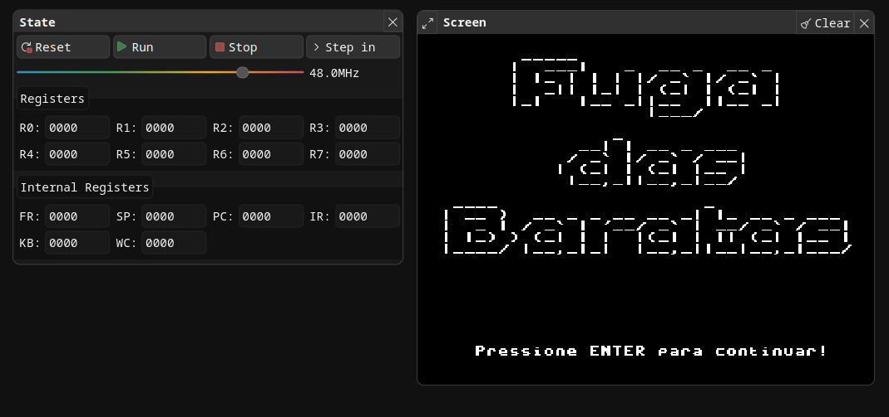

# [FUGA DAS BARATAS](#fuga-das-baratas)  
Trabalho da matéria **SSC0513**, contendo o jogo feito em Assembly. 

---

## Sumário  
1. [Descrição Geral](#descrição-geral)  
2. [Como Jogar?](#como-jogar)  
3. [Guia de Imagens](#guia-de-imagens)  
4. [Curiosidade: O Simulador de Processador](#curiosidade-o-simulador-de-processador)

---

## [Descrição Geral](#descrição-geral)  
"Fuga das Baratas" é um jogo desenvolvido em Assembly, no qual o jogador é o personagem da música "Toda vez que eu chego em casa a barata da vizinha ta na minha cama". Para vencer o jogo, ele deve acertar 10 chineladas na barata.

O jogo foi projetado para ser executado no [Simulador de Processador](https://proc.giroto.dev/) ou no Simple Simulate.
O Simple Simulator pode ser encontrado [aqui](https://github.com/brubru8888/Fuga-das-Baratas/blob/main/Simulador/README.md#detalhes-dos-multiplexadores). 

---

## [Como Jogar?](#como-jogar)  

Recomendamos utilizar o simulador de processador disponível em: [https://proc.giroto.dev/](https://proc.giroto.dev/).  

Para jogar, siga os passos abaixo:  
1. **Baixe os arquivos:**  
   - [`charmap.mif`](#)  
   - [`fuga_das_baratas.asm`](#)  

2. **Acesse o simulador:**  
   - Clique em [Simulador de Processador](https://proc.giroto.dev/).  

3. **Importe os arquivos:**  
   - Importe o `charmap.mif` no campo **Charmap**.  
   - Importe o `fuga_das_baratas.asm` no campo **File**.  

4. **Construa e execute:**  
   - Clique em **BUILD** para compilar o código.  
   - Ajuste a frequência para ~50.0 MHz (ou um valor da sua escolha).  
   - Clique em **RUN** para iniciar o jogo.  

5. **Divirta-se!**  
   - Siga as instruções na tela e aproveite o jogo.

---

## [Guia de Imagens](#guia-de-imagens)  

### 1. Importando os arquivos:  
Importe os arquivos `.asm` e `.mif` no respectivo campo no simulador.  

  

---

### 2. Compilando o código:  
Clique no botão **BUILD** para compilar o código Assembly.  

  

---

### 3. Executando o jogo:  
Ajuste a frequência do simulador e clique em **RUN** para jogar.  

  

---
